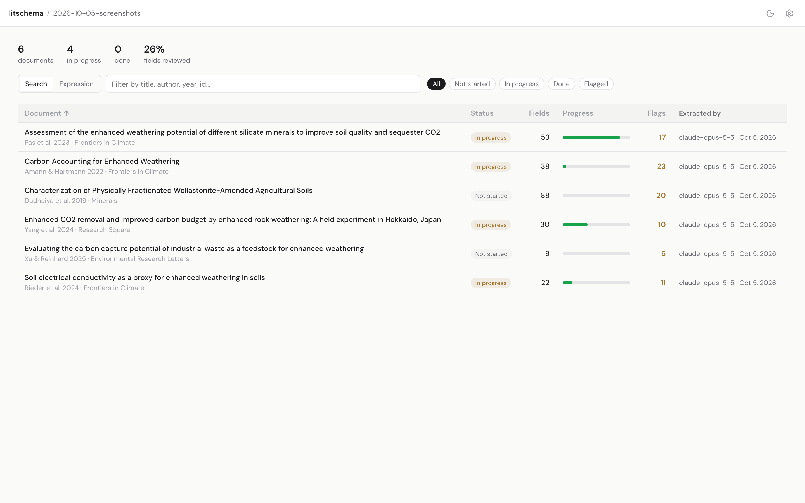
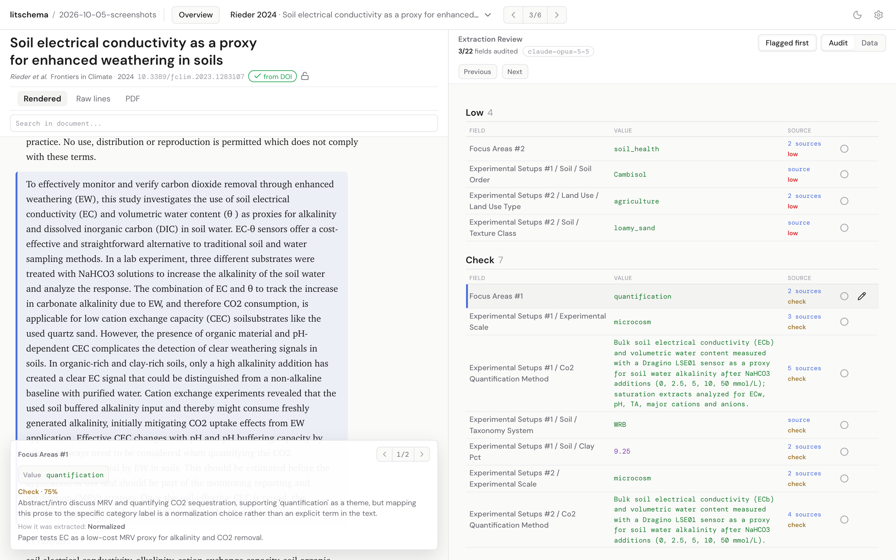

# litschema

**Turn a folder of PDFs into a dataset you can defend.**

litschema extracts structured data from scientific papers into a schema you
define in [LinkML](https://linkml.io). Each value records where it came from,
how it was derived, how likely it is to be right, and whether a person checked
it:

- **Cited lines.** Every value points at the lines of the paper it came from,
  and validation rejects citations to lines that don't exist.
- **Provenance.** Each extraction run is immutable and records the hashes of
  its inputs (PDF, prepared text, schema, prompt) and the model that produced
  it.
- **An independent grader.** A second model checks each value against its
  evidence and gives the probability that the value is correct.
- **Human review.** You verify, correct, or remove each value in a local web
  app. Your review is stored as plain JSON beside the run it reviews.

Everything runs on your machine, through the coding agents you already have
([Claude Code](https://claude.com/claude-code) or
[Codex](https://developers.openai.com/codex)), paid by your own subscription or API key. See
[supported coding agents](quickstart.md#supported-coding-agents). The only
other network calls are optional DOI lookups.

!!! warning "Alpha software"
    File formats can change before 1.0. Each release lists its breaking
    changes in the [changelog](https://github.com/clevinson/litschema/blob/main/CHANGELOG.md).

[Get started](quickstart.md){ .md-button .md-button--primary }
[How it works](concepts.md){ .md-button }
