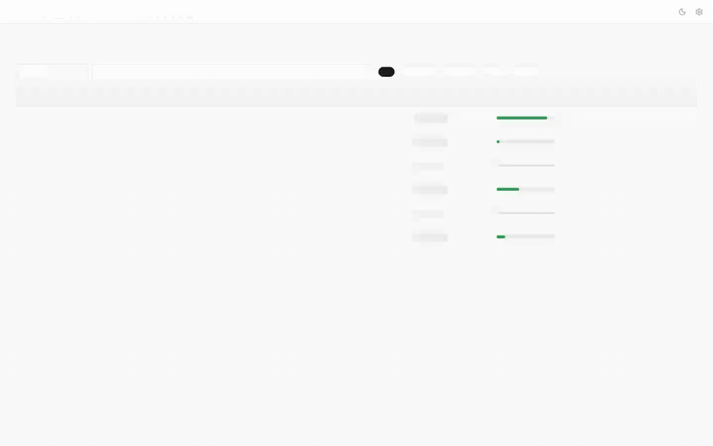

# Reviewing

```bash
litschema verify
```

The app runs on `127.0.0.1` only and loads nothing from the network.

## Overview

The overview lists every paper with its review progress, its flag count (check,
low, and can't-verify values from the latest grade), and its status. You can
filter by text or with an expression, and sort by any column. The filter and
sort stay in the URL.


## A paper

The left pane shows the paper's prepared text with its tables and figures. The
lines cited by the selected value are highlighted, and Raw lines and the PDF
sit in tabs beside the text. The right pane lists the extracted values. Flagged
values come first: low, then check, then can't verify, then inferred or assumed
values.


Select a value to see its evidence:

- **How it was extracted**: the basis and the extractor's note.
- **Grader**: the band, the probability ("Check · 72%"), and the issue.

Then **verify** the value, **correct** it with a typed editor, or **remove**
it. Each action writes one entry to the run's `review.json`. Press `Esc` to go
back to the overview.


